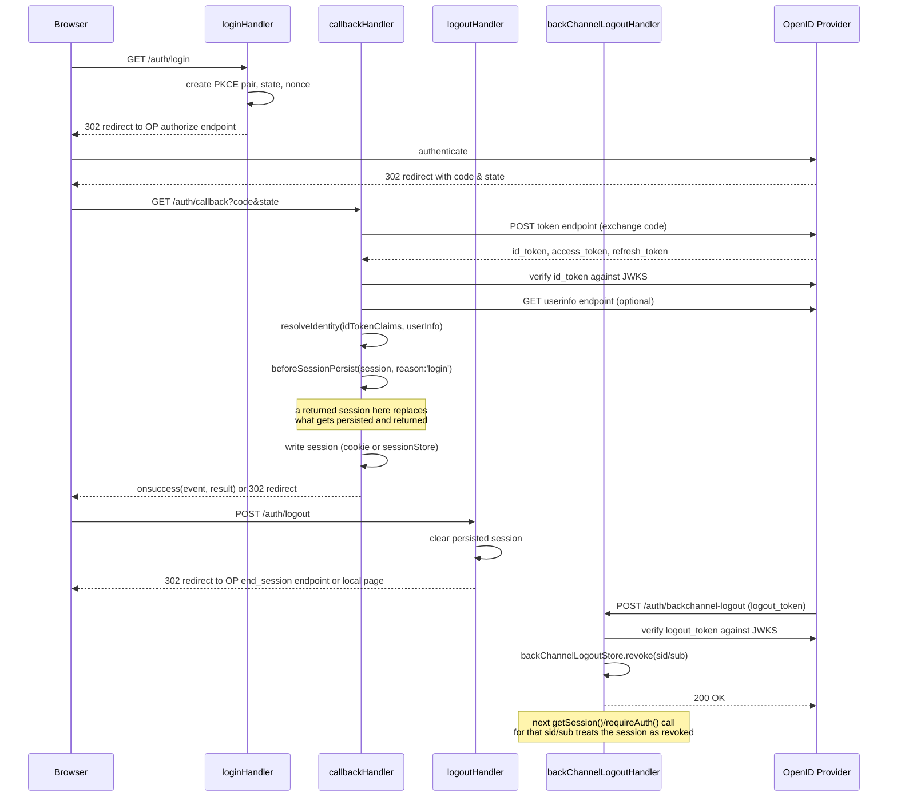

# sveltekit-oidc

[](https://www.npmjs.com/package/@sourceregistry/sveltekit-oidc)
[](LICENSE)
[](https://svelte.dev/)

OIDC authentication and session management for SvelteKit.

The library keeps three concerns separate:

- provider protocol data: validated ID token claims and optional UserInfo
- persisted authentication: tokens and the resolved application identity
- request data: application-owned authorization loaded once per request

It implements the protocol itself and does not depend on `openid-client`.

## Install

```sh
npm install @sourceregistry/sveltekit-oidc
```

## Configure

```ts
// src/lib/server/auth.ts
import {createOIDC} from '@sourceregistry/sveltekit-oidc/server';

type Identity = {
    sub: string;
    email?: string;
    name?: string;
    roles: string[];
    permissions?: string[];
};

type RequestData = {
    permissions: string[];
};

export const oidc = createOIDC<Identity, RequestData>({
    issuer: 'https://identity.example.com',
    clientId: process.env.OIDC_CLIENT_ID!,
    clientSecret: process.env.OIDC_CLIENT_SECRET!,
    clientAuthMethod: 'client_secret_basic',
    cookieSecret: process.env.OIDC_COOKIE_SECRET!,
    scope: ['openid', 'profile', 'email', 'offline_access'],

    resolveIdentity: ({idTokenClaims, userInfo}) => ({
        sub: idTokenClaims.sub,
        email: userInfo?.email ?? idTokenClaims.email,
        name: userInfo?.name ?? idTokenClaims.name,
        roles: Array.isArray(userInfo?.roles ?? idTokenClaims.roles)
            ? ((userInfo?.roles ?? idTokenClaims.roles) as string[])
            : []
    }),

    beforeSessionPersist: async ({session, reason}) => {
        const identity = await synchronizeUser(session.identity, reason);
        return {...session, identity};
    },

    loadRequestData: async ({session, event}) => ({
        permissions: await loadPermissions(session.sub!, event)
    }),

    createPublicSession: ({base, data}) => ({
        ...base,
        identity: {
            ...base.identity,
            permissions: data?.permissions ?? []
        }
    })
});
```

`cookieSecret` must contain at least 32 bytes of entropy. For example:

```sh
openssl rand -base64 32
```

Discovery and protocol endpoints must use HTTPS by default. Set `allowInsecureHttp: true` only for
local development providers. `openid` is always included in the requested scope, and values in
`extraParams` cannot replace security-sensitive authorization parameters such as `state`, `nonce`,
PKCE, `redirect_uri`, or `client_id`.

If the client registration fixes an ID-token signing algorithm, pin it explicitly:

```ts
idTokenSigningAlgorithms: ['RS256'],
trustedIdTokenAudiences: ['https://api.example.com']
```

The client ID is always required in `aud`. `trustedIdTokenAudiences` permits only explicitly trusted
additional audience values; it does not replace the client ID.

The extension points have deliberately literal names:

| Extension point        | When it runs                                                    | Persisted                                     |
| ---------------------- | --------------------------------------------------------------- | --------------------------------------------- |
| `resolveIdentity`      | After provider data is validated, on login and refresh          | Its result is persisted                       |
| `beforeSessionPersist` | Immediately before a login or refreshed session is written      | Returned session replaces it; `void` keeps it |
| `loadRequestData`      | Once while `handle` builds an authenticated request context     | Never                                         |
| `createPublicSession`  | When `getPublicSession` or `toPublicSession` projects a session | Never                                         |

Both login and refresh are explicit in the callback context. Returning a session from
`beforeSessionPersist` is what makes it the right place to provision or enrich application data —
e.g. upserting a user row — before the very first session for that user is persisted:

```ts
beforeSessionPersist: async ({session, reason}) => {
    if (reason !== 'login') return;
    const user = await upsertUser(session.identity);
    return {...session, identity: {...session.identity, ...user}};
};
```

`resolveIdentity` runs first and may only be able to _read_ application data (the user may not
exist yet on a first login). `beforeSessionPersist` runs next, right before the write, so a session
mutated or replaced there is the one every subsequent read of that session — including the result
returned from `handleCallback`/`callbackHandler`'s `onsuccess` — actually sees.

## SvelteKit hook

```ts
// src/hooks.server.ts
import {oidc} from '$lib/server/auth';

export const handle = oidc.handle;
```

For every request, `handle` exposes:

```ts
event.locals.oidc.session; // persisted OIDC session
event.locals.oidc.identity; // resolved identity
event.locals.oidc.data; // request-only application data
```

Type the locals directly from the configured instance:

```ts
// src/app.d.ts
import type {OIDCLocals} from '@sourceregistry/sveltekit-oidc/server';
import type {oidc} from '$lib/server/auth';

declare global {
    namespace App {
        interface Locals {
            oidc?: OIDCLocals<typeof oidc>;
        }
    }
}

export {};
```

## Routes

```ts
// src/routes/auth/login/+server.ts
import {oidc} from '$lib/server/auth';
export const GET = oidc.loginHandler();
```

```ts
// src/routes/auth/callback/+server.ts
import {oidc} from '$lib/server/auth';
export const GET = oidc.callbackHandler();
```

```ts
// src/routes/auth/logout/+server.ts
import {oidc} from '$lib/server/auth';
export const POST = oidc.logoutHandler();
```

```ts
// src/routes/auth/backchannel-logout/+server.ts
import {oidc} from '$lib/server/auth';
export const POST = oidc.backChannelLogoutHandler();
```

The underlying operations are also available directly when a route needs custom behavior:

- `login(event, options)`
- `handleCallback(event)`
- `logout(event, options)`
- `handleBackChannelLogout(event)`

### Request flow



`handle` (the SvelteKit hook) wraps every request outside of these four routes: it calls
`getSession`, which transparently refreshes an expiring session — running `resolveIdentity` and
`beforeSessionPersist` again with `reason: 'refresh'` — before exposing `event.locals.oidc`.

- `getSession(event)`
- `requireAuth(event)`
- `clearSession(cookies)`

## Public session

Load a token-free session for the browser:

```ts
// src/routes/+layout.server.ts
import {oidc} from '$lib/server/auth';

export async function load(event) {
    return {
        session: oidc.toPublicSession(event.locals.oidc, event.depends),
        sessionManagement: await oidc.getSessionManagementConfig()
    };
}
```

`toPublicSession` projects the request context already loaded by `handle`. It does not read the
store, refresh tokens, or load application data again. `createPublicSession` receives both the
persisted session and `loadRequestData` result, but only exposes what the application explicitly
returns. `getPublicSession(event)` is available when the hook has not already loaded the context.

## Client context

```svelte
<script lang="ts">
	import { OIDCContext } from '@sourceregistry/sveltekit-oidc';
	let { data, children } = $props();
</script>

<OIDCContext
	session={data.session}
	config={data.sessionManagement}
	idleTimeoutMs={30 * 60 * 1000}
	idleWarningMs={60 * 1000}
	heartbeatUrl="/auth/heartbeat"
>
	{@render children()}
</OIDCContext>
```

```svelte
<script lang="ts">
	import { useOIDC } from '@sourceregistry/sveltekit-oidc';
	const oidc = useOIDC();
</script>

{#if oidc.isAuthenticated}
	<p>Signed in as {oidc.identity?.email ?? oidc.identity?.name}</p>
{/if}
```

`OIDCContext` supports local expiry handling, targeted SvelteKit revalidation,
`check_session_iframe` monitoring, and local or provider logout.

Idle deadlines use absolute timestamps, synchronize activity across tabs, and remain correct after a
tab or device resumes from sleep. The default idle action performs provider logout; set
`redirectOnIdle="logout"` only when clearing the application session without ending the OP
session is intentional. `heartbeatUrl` is application-owned and should be a same-origin,
CSRF-protected endpoint that returns `401` or `403` when the session is no longer valid.

When the OP iframe reports `changed`, the component first performs the Session Management 1.0
`prompt=none` authorization check in a hidden iframe. The login handler supplies the current ID token
as `id_token_hint`; a matching End-User refreshes the local session, while an OP error or a different
End-User clears it. Applications using the standard `loginHandler()` and `callbackHandler()` routes do
not need an additional endpoint.

## Session stores

Without `sessionStore`, the encrypted session is stored in the cookie. The default maximum serialized
cookie size is 3800 bytes so oversized sessions fail explicitly instead of being silently truncated by
a browser or proxy. Use a server-side store for large tokens or identities:

```ts
import type {OIDCSessionStore} from '@sourceregistry/sveltekit-oidc/server';

const sessionStore: OIDCSessionStore<Identity> = {
    get: (id) => redis.get(`session:${id}`),
    set: async (id, session) => {
        await redis.set(`session:${id}`, session);
    },
    delete: async (id) => {
        await redis.delete(`session:${id}`);
    }
};
```

Use a shared `backChannelLogoutStore` when back-channel logout must work across multiple instances.
The built-in `'memory'` stores are intended for local development or single-process deployments.

Providers that rotate refresh tokens also need a distributed `refreshLock` in multi-instance
deployments. The built-in promise coalescing prevents duplicate refreshes within one process; the
lock must serialize the supplied operation by session ID across every application instance:

```ts
const refreshLock = {
    runExclusive: <T>(sessionId: string, operation: () => Promise<T>) =>
        redlock.using([`oidc-refresh:${sessionId}`], 10_000, operation)
};
```

## Security behavior

- Authorization Code flow uses PKCE, nonce, and an encrypted state value; each pending authorization
  transaction has its own cookie, so concurrent logins in separate tabs do not overwrite each other.
- Discovery metadata is bound to the configured issuer, and HTTPS is required unless explicitly
  disabled for local development.
- Initial ID tokens require matching issuer, client audience, nonce, `exp`, and `iat`. Refreshed ID
  tokens may omit nonce as allowed by OIDC Core, but must preserve subject, audiences, authorized
  party, and authentication time.
- UserInfo `sub` must match the validated ID token subject.
- Cookie sessions use authenticated encryption.
- Return and post-logout redirect values are restricted to same-origin paths.
- Local sessions have an eight-hour maximum lifetime by default.
- Refresh is automatic while a valid refresh token is available and is coalesced per session within a
  process.
- Back-channel logout tokens require the logout event, `iat`, `exp`, `jti`, and exactly one or both of
  `sid` and `sub`; `nonce` is rejected. Revocations expire and do not revoke later logins permanently.
- Local session clearing does not depend on provider discovery being available.
- Client authentication supports `none`, `client_secret_basic`, `client_secret_post`, `client_secret_jwt`, and `private_key_jwt`.

Application code can normalize provider-specific data in `resolveIdentity`, but cannot replace the
validated ID token claims used by the protocol implementation.
